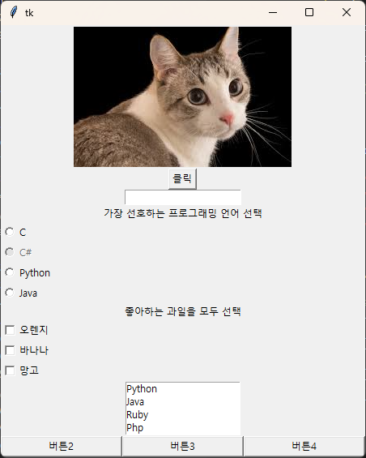

# iot-python-2025
IoT 개발자 기초 프로그래밍 언어 리포지토리

## 1일차
- 개발환경설정
    - 압축, 폰트, 개발용 에디터 설치
        - 반디집(교육, 회사에서 사용시 무료)
        - 나눔글꼴 중 D2Coding, 추후 나눔고딕코딩 필요
        - NotePad++
    - Visual Studio Code 설치
        - 확장 Korean
        - Font Family D2Coding 추가, Mouse Wheel Zoom 가능 설정

- 프로그래밍 언어 종류
    - 컴파일러(실행파일 생성)
        - C, C++, C#, Java, ...
    - 인터프리터(소스코드 바로 실행, 실행파일 없음)
        - 파이썬, JavaScript

- 파이썬(Python)
    - 1991년에 개발한 인터프리터 언어
    - 네덜란드계 프로그래머 귀도 반 로섬
    - 객체지향 프로그래밍 언어(Object Oriendted Program)
    - 아주 쉽게 학습할 수 있는 언어
    
- 파이썬 개발환경 Pyenv
    - 파이썬 버전을 손쉽게 변경할 수 있는 툴
    - 파워셀 관리자 모드 오픈, 아래의 명령어 실행
        ```shell
        > Set-ExecutionPolicy -ExecutionPolicy RemoteSigned -Scope LocalMachine
        ```
    - https://pyenv-win.github.io/pyenv-win/
        - Quick Start 1번 실행
        - pyenv로 파이썬 버전 설치 및 전역설정

- Visual Studio Code
    - 확장에서 Python 설치
    - *.py 파일 생성 후 코딩
    - Ctrl + F5로 실행


## 2일차
- 파이썬 기초
    - 변수
        - `데이터`를 담아서 다른 곳에 활용하기 위해 변수 사용
    - 자료형
        - None, int, float, str, bool, list, tuple, dictionary, set, ...
        - type() 함수로 <class '자료형'> 확인가능
    - 화면입출력 - 콘솔에서 입력하고 결과 출력
        - input(), print()
    - 문자열 포맷팅
        - 문자열을 좀 더 깔끔하게 표현
        - %s, %d, %f ...
        - {0}, {1}, {2}.format() ...
        - f'{name}...{age}'
    - 연산자
        - 사칙연산 : +, -, *, /, //, %, **, (, )
        - 리스트연산 : list[0], list[0:3 + 1]
        - 문자열연산 : split(), replace(), strip(), find(), upper(), lower() 
   
- 깃허브[데스크톱]
    1. **fetch origin** : 리모트 최신변경사항 확인(중요!)
    2. pull : 리모트에 변경사항을 로컬로 내려받기
    3. commit : 로컬, 리모트에 변경사항을 확정
    4. push : 로컬의 변경사항을 리모트로 올리기

## 3일차
- 파이썬 기초
    - 흐름제어
        - if - 참을 기준으로 분기
        - for - 일반적인 반복문
        - while - 참인 조건일 동안 무한 반복
    - 파일입출력
        - open(경로,mode='r|w|a', encoding='utf-8')
        - write(), readline()
        - close()
    - 함수
        - f(x) = y
        - 자주 사용할 로직을 묶어놓은 덩어리
        - 함수 호출
        ```python
        def funcName(param):
            # 로직
        ```
    - 객체지향
        - 현실세계와 동일하게 프로그래밍 하겠다는 설계방식
        - 객체의 틀이되는 클래스를 선언
        - 클래스 : 명사와 동사의 집합
            - 명사 : 멤버변수(속성)
            - 동사 : 멤버함수(메서드)
        ```python
        class ClassName:
            # 멤버변수

            def 멤버함수(self, param):
                # 로직
        ```
        
## 4일차
- 파이썬 기초
    - 리스트 연산 추가
        - append(), insert(index, Value), del(list[index]), pop(), sort(), reverse(), ...
    - 객체지향 다시
        - 모든 클래스의 조상은 object 클래스! (class object)
        - 클래스 작성방법
        - 속성(멤버변수)
        - 메서드(멤버함수)
        - 캡슐화 - 멤버변수 폐쇄화(__멤버변수)
        - 상속 - 상위 클래스를 가지고 자식 클래스를 만드는 것
        - **추상화**
        - **인터페이스**
        - **다형성**
        - **SOLID 원칙**

    - 모듈, 패키지
        - 모듈 : 함수나 클래스 등 자주 사용할 파이썬 파일로 만든 것
        - 패키지(라이브러리) : 모듈을 모아둔 폴더
        - pip : 외부 모듈 다운로드 후 설치하는 명령어 (```pip install requests```)

    - 예외처리
        - 실행 중 프로그램이 비정상 종료되는 Error

## 5일차
- 파이썬 기초
    - 예외처리, 디버깅
        - 프로그래밍에서 가장 중요!
        - 실행 중 발생, 프로그램을 비정상 종료시키는 것
    - 디버깅
        - F9, F5, F10, F11, Shift+F5, 변수탭, 조사식탭
        - 버그를 잡을 때 가장 유용
        - 소스코드를 분석할 때

- 파이썬 응용
    - 토이프로젝트
        - 콘솔앱 : My Movie List 영화 즐겨찾기

## 6일차
- 파이썬 응용
    - 토이프로젝트
        - 내 영화 앱 수정, 마무리
            - 예외처리 : 입력 시 바로 엔터, 입력 시 4개의 아이템을 입력하지 않으면 
            - 화면편집 : 검색이나 출력시 데이터 수 표시

https://github.com/user-attachments/assets/ec8a1bad-f8a5-47d4-888a-00768a43933d

- 파이썬 응용 
    - 주피터 노트북 기본 사용법
        - 파이썬을 사용, 연구를 목적으로하는 리포트 작성에 특화된 기술
        - 주피터 프로젝트에서 나온 결과물
        - Ctrl + Shift + P(명령 팔레트)에서 시작
            - Create: 새 Jupyter 노트북 클릭
            - 무조건 저장 먼저(.ipynb)
        - GUI 학습에는 불합리
        - 빅데이터분석, 머신러닝, 딥러닝 많이 활용

    - GUI 학습(tkinter)
    - PyQt 학습

    - 토이프로젝트
        - 챗GPT 윈도우 앱(tkinter) 만들기
        - 윈도우앱(PyQt)

    - GUI 학습
        - GUI(Graphic User Interface) - 그래픽 사용자 인터페이스. 
        - GLI(Command Line Interface) - GUI 이전에 사용자 인터페이스. 사용이 불편, 사용자가 명령어를 외워서 사용

    - 파이썬 GUI 라이브러리
        1. PyQt : 파이썬 최고의 GUI 라이브러리. Qt라는 C/C++ 사용할 GUI 라이브러리를 Python용으로 변경
            - 화려한 UI 구성
            - 코딩 다양성
            - 조금 어렵다(파이썬 코드와 분리)
            - Qt 라이선스 구매 필수, 프리웨어로 변경한게 Pyside
        2. tkinter : 파이썬에 내장된 GUI 라이브러리
            - 아주 단순. 학습이 쉬움
            - 파이썬 기본 내장
            - 이쁘지 않음
        3. Kivy : 가장 최근에 나온 GUI 라이브러리
            - 안드로이드, IOS 모바일 앱 UI 사용가능
            - 모바일특화로 멀티플랫폼 지원
            - 가장 어렵다

    - Tkinter 학습
        - 기본 템플릿

        ```python
        from tkinter import *

        root = Tk()
        # 이 사이에 위젯, 이벤트 등 작성
        # Label, Button, Entry, Radiobutton,
        # Checkbutton, Listbox, Frame 등 ...
        # 위젯.pack() 필수!
        root.mainloop()
        ```

<!-- 주석 -->
<!-- html에서 사용하는  태그로 캡쳐한 이미지 추가 -->
<!--  크기 조절 불가능한 이미지 링크-->


## 7일차
- 파이썬 응용
    - 토이프로젝트
        - ChatGPT 유사앱 - 구글 제미나이 API
    - 실습
        - 제미나이 챗앱 -> **클래스형태**로 변경


https://github.com/user-attachments/assets/457ef153-8770-4dd8-b1f4-245ccac15f94


- 파이썬 응용
    - 실행파일 만들기
        - `pyinstaller` 모듈 설치
            - pip install pyinstaller
        - 실행파일 생성 명령어(터미널 실행)
            - pyinstaller --onefile python_file.py
            - 같이 실행되는터미널을 제거하려면
            - pyinstaller --onefile --noconsole 파이썬 파일명
            - 아이콘 등의 리소스를 dist 폴더에 복사 필요

## 8일차
- 파이썬 응용
    - GUI 중 PyGame
        - 기본 윈도우 학습
        - 이벤트 처리
        - 간단한 게임
        - 이미지, 사운드 등 리소스 활용 게임

    - 토이프로젝트
        - 블록깨기 게임
        - 공의 x축 방향 계산방법 : $x = r \cdot \cos \theta$
        - 공의 y축 방향 계산방법 : $y = r \cdot \sin \theta$
<!--  $$ y = r \cdot \sin \theta $$ -->

